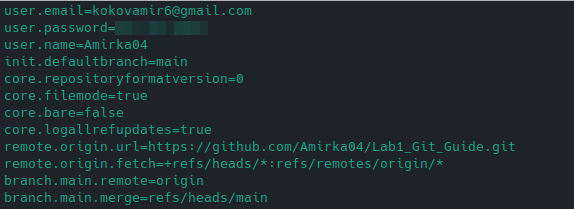

# Базовые команды git для начало работы с ним :octocat:

## Карта
  - [Настройка git](#настройка-git)
  - [Инициализация проекта](#инициализация-проекта)
  - [Команда git add](#команда-git-add)
  - [Команда git rm](#команда-git-rm)
  - [Комиты. commit](#комиты-commit)
    - [коротко о `git diff`](#коротко-о-git-diff)
    - [Коротко о `git log`](#коротко-о-git-log)
  - [Создание веток](#создание-веток-в-git)
  - [Переключение между веток](#создание-веток-в-git)
  - [Удаление веток](#удаление-веток)
  - [Слияние веток](#слияние-веток)
  - [Заливка проекта](#заливка-проекта)
  - [Клонирование проекта](#клонирование-проекта)
  - [Приятный бонус. Файл .gitignore](#приятный-бонус)


---


### Настройка git
**Для лучшего понимания, рекомендую сайт с игрой: [GitGame](https://learngitbranching.js.org/?locale=ru_RU)**

Прежде чем начать работать с git, нам его следует настроить, естественно в терминале.

Первое с чего начнём это ввод имени пользователя и почты

`git config --global user.name "Amir"`

`git config --global user.email Amir@example.com`

Данная настройка очень важна т.к. эта информация содержится во всех комитах и в github тоже :smile:, а флаг `--global` нужен для того что бы эти данные мы ввели 1 раз (т.е. для всех след. проектов нам не нужно будет вводить своё имя и почту)

Для проверки всех настроек, можно ввести команду 

`git config --list`

должно вывести что то наподобие этого:



Рассмотрим некоторые из них
`user.email` и `user.name` - это то что мы ввели ранее, наши имя и почта

> *И да, чуть не забыл, если вдруг в терминале не получается набрать какой либо текст, не бойтесь, это редактор кода в терминале, называется vim, просто перейдите на английскую раскладку и нажмите на `q`*

можно заметить что есть поле `remote.origin.url`, об этом подробрее немного позже, но если говорить об этом кратко, то это ссылка на удалённый репозиторий

`branch.main.remote` - данный параметр указывает главную ветку где будут храниться наши комиты

### Инициализация проекта
Что бы инициализировать проект, нам потребуется конечно-же зайти в директорию проекта и прописать след команду:

`git init`

Что происходит после выполнения данной команды, она создаёт папку `.git` со всеми настройками, файлами изменений наших файлов и многое многое другое :smiley:

---

### Команда git add
Для того что бы git следил за изменениями нашего файла, нам его нужно добавить, делается это командой `git add имя_файла.расширение` и всё :smiley:

Есть пару приёмов которые могут вам помочь в дальнейшем :trollface:

Бывает такое что нужно добавить все файлы что были в проекте, то для этого есть флаг `--all` просто введите команду `git add --all`

Есть и вторая запись данной команды `git add .` (эта точка указывает на то что нужно выбрать все файлы в данной директории)

Для того что бы узнать все подробности команды `add` введите `git add --help`

Забегая вперёд, что бы проверить был ли добавлен тот или иной файл в список отслеживаемых файлов, пропишите `git status`

В случае если вам нужно добавить целую папку, то тут всё анологично что и с файлами, просто прописываете `git add имя_папки` и все файлы которые находились внутри, тоже добавятся

---

### Команда git rm
Бывает такое, что мы случайно добавили файл или папку за изменениями которой не нужно следить, в этом случае можно воспользоваться командой rm
у которой 2 флага:
- `--cashed` - удаляет файл из списка, но не из рабочего пространства, то есть он просто перестанет за ним следить, но при этом этот файл всё ещё будет оставаться в папке
- `--force` - удаляет файл и из списка и из рабочего пространства, то есть файл стирается полностью без возможности восстановления

Вот пример использования `git rm --cached`:
</img>

Тут я создал файл `tmp.txt` и добавил его в список git

`git rm --cached tmp.txt` успещно удалил файл из списка, но оставил его на рабочем пространстве


Вот пример использования `git rm --force`:

</img>

Тут я создал файл `tmp.txt` и тут же добавил его в список git, после применения команды

`git rm --force tmp.txt` наш файл благополучно удалился, но для работы данной команды, нужно объязательно добавить файл в проект, иначе вы получите предупреждение, мол, для удаления нужно его добавить в git

---

### Комиты. commit
Комиты что то вроде фотоаппатара которые фиксируют изменения, если говорить на основе примера, предположим в файл в кодом:

```cpp
#include <iostream>
int main(){
    std::cout << "Hello world" << std::endl;
    return 0;
}
```

Внесли некоторые изменения:

```cpp
// my first program
#include <iostream>
using namespace std;

int main(){
    cout << "Hello GitHub" << endl;
    return 0;
}
```

Добавили командой `git add main.cpp`, но надо эти изменения как то зафиксировать, тут нам помогут комиты, у комитов.

Изменения между последней фиксацией и текущей, то есть когда мы делаем комит, он смотрит: что же у нас изменилось? И все изменения записывает в определённое место
#### коротко о `git diff`
Что бы просмотреть что же именно он записывает, можно воспользоваться командой `git diff`, что означает `difference` - разница.

Приведу пример из текущего своего проекта:


Тут мы можем видеть много много всего, но тут главные только 2 вещи, это `+`, `-` отмеченные красным и зелённым

`+` - это добавленные строчки, учитывается всё: пробелы, переносы строк и табы, всё это нужно в дальнейшей работы с git

`-` - это строчки которые мы изменили либо удалили, так же учитывается каждое изменение в файле

А комит фиксирует эту разницу, тем самым экономя нам место :smile:

Что бы сделать комит, следует добавить файлы в список, а затем уже комитить:
```bash
git add .
git commit -m "first commit"
```

`-m` обозначает, что комит несёт в себе сообщение, при просмотре логов командой `git log` будет видно, что у кажного комита есть свой адрес и название, если вдруг вы не укажете этот фраг, то вас перенесёт на редактор vim, откуда вам придётся назвать ваш комит.

##### Коротко о `git log`
`git log` - показывает все комиты сделанные, ранее это полезно когда нужно:

1. Отслеживание изменений: git log позволяет вам отслеживать изменения, внесенные в репозиторий. Вы можете увидеть, кто внес изменения, когда они были внесены и какие изменения были внесены.

2. Поиск ошибок: Если вы обнаруживаете ошибку в коде, вы можете использовать git log для отслеживания изменений, которые были внесены в файлы, где обнаружена ошибка. Это может помочь вам определить, когда и кем была внесена ошибка.

3. Восстановление предыдущих версий: Если вы хотите вернуться к предыдущей версии файла или проекта, вы можете использовать git log для нахождения хеша коммита, который содержит нужную версию.

4. Управление версиями: git log позволяет вам отслеживать изменения, внесенные в репозиторий, что может быть полезно при управлении версиями проекта.

---

### Создание веток в git
Ветки в Git используются для создания отдельных линий разработки, которые могут быть независимо отслеживаемы и обновляемы. Ветки могут быть полезны в следующих ситуациях:

1. Разработка новых функций: Если вы работаете над новой функцией, вы можете создать новую ветку, чтобы изолировать вашу работу от основной ветки. Это позволит вам экспериментировать и тестировать новую функцию, не нарушая работу основной ветки.

2. Исправление ошибок: Если вы обнаруживаете ошибку в коде, вы можете создать новую ветку, чтобы исправить ошибку и тестировать исправления, не нарушая работу основной ветки.

3. Разработка отдельных версий: Если вы работаете над несколькими версиями проекта, вы можете создать отдельные ветки для каждой версии. Это позволит вам отслеживать и обновлять каждую версию независимо.

4. Разработка отдельных функций: Если вы работаете над несколькими функциями, вы можете создать отдельные ветки для каждой функции. Это позволит вам отслеживать и обновлять каждую функцию независимо.

Что бы создать ветку, нужна команда 

`git branch имя_ветки`

что бы создать и переключиться на созданную ветку можно прописать команду 

`git branch -b имя_ветки`

Для просмотря всех созданных веток, можно воспользоваться командной

`git branch --list`

---

### Переключение между ветками
`git checkout имя_ветки` - используется для переключения между ветками, но стоит учесть, что изменения которые были произведены в файле на другой ветке, не сохраняться в другой.

`git checkout -- имя_ветки` - данная команлда решает проблему с не сохранёными изменениями в других ветках.

`git switch имя_ветки` - является аналогом команды `checkout`

### Удаление веток
`git chechput -d имя_ветки` - Удаляет ветку, но если на ветке есть не сохранёные изменения, то лучше вместо флага `-d` применить `-D`

если же надо будет удалить ветку в удалённом репозитории:

`git push origin --delete имя ветки`


### Слияние веток
Пожалуй это последнее базовое действие в git над ветками

Слияние это процесс объединения 2-х веток одной ветки в другую, предположим, что вы находитесь на ветке master и к ней нужно слиять ветку bugFix
`git merge bugFix`

Если на ветке есть конфликты, то следует добавить файлы и закомитить их, после чего можно будет проводить слияние, это лучший вариант, но можно проигнорировать изменения и добавить флаг `--no-ff`

`git merge --no-ff bugFix`


### Заливка проекта
`git push` заливает наш проект на сайт github, где уже другие люди могут клонировать ваш репозиторий, смотреть что изменилось в вашем проекте и т.д

Прежде чем писать выше написанную команду, следует создать репозиторий, где будет находиться наш проект, нужно будет следовать инструкции вот
[тут](/GuideGithub.md#как-создать-удалённый-репозиторий).

### Клонирование проекта
`git clone ssh/http_addres` - эта команда позволяет копировать проект из одного удалённого репозитория к себе на компьютер.

### Приятный бонус
В git есть файл: `.gitignore`, думаю из названия понятно, что это файл для игнорирования чего-то, создав такой файл он будет говорить git игнорировать файлы и папки записанные в него, для игнорирования файла достаточно записать его имя с расширением, а для папки, следует указать имя папки в директории, ну или же путь до неё и добавить в конец **/**
