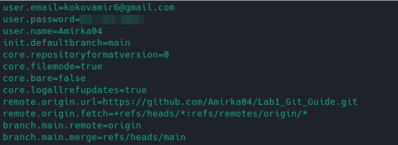

# Базовые команды git для начало работы с ним

## Карта
* [Настройка git](#настройка-git)
* [Инициализация проекта](#инициализация-проекта)
* [Добавление файлов и каталогов. Команда add](CommandAdd.md)
* [Удаление файлов и каталогов. Команда rm]()
* [Коммиты]()
* [Просмотр всех коммитов. Команда log]()
* [Просмотр изменений. Команда diff]()
* [Состояние. Команда status]()
* [Заливка проекта. Команда push]()
* [Копирование проекта из удалённого репозитория. Команда clone]()
---

### Настройка git
Прежде чем начать работать с git, нам его следует настроить, естественно в терминале.

Первое с чего начнём это ввод имени пользователя и почты

`git config --global user.name "Amir"`

`git config --global user.email Amir@example.com`

Данная настройка очень важна т.к. эта информация содержится во всех комитах и в github тоже 🙂, а флаг `--global` нужен для того что бы эти данные мы ввели 1 раз (т.е. для всех след. проектов нам не нужно будет вводить своё имя и почту)

Для проверки всех настроек, можно ввести команду 

`git config --list`

должно вывести что то наподобие этого:

Рассмотрим некоторые из них
`user.email` и `user.name` - это то что мы ввели ранее, наши имя и почта

можно заметить что есть поле `remote.origin.url`, об этом подробрее немного позже, но если говорить об этом кратко, то это ссылка на удалённый репозиторий

`branch.main.remote` - данный параметр указывает главную ветку где будут храниться наши комиты

### Инициализация проекта
Что бы инициализировать проект, нам потребуется конечно-же зайти в директорию проекта и прописать след команду:

`git init`

Что происходит после выполнения данной команды, она создаёт папку `.git` со всеми настройками, файлами изменений наших файлов и многое многое другое 🙂

С этим пока что всё, погнали [дальше](CommandAdd.md) :joy: